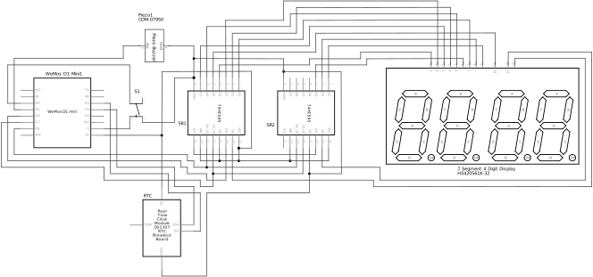
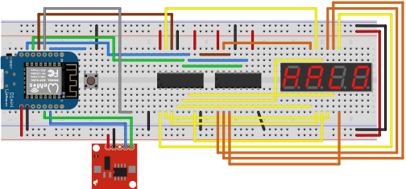

# ArduinoClock
A clock in Arduino with a Seven Segment, an RTC, ticking sound and NTP updates

#### Pinout
| Wemos D1 mini | 74HC595 (SR1) | 74HC595 (SR2) | Seven Segment | RTC | Buzzer | Button |
| ------------- | ------------- | ------------- | ------------- | --- | ------ | ------ |
| D0 |  |  |  |  |  | Terminal 1 |
| D1 |  |  |  | SCL |  |  |
| D2 |  |  |  | SDA |  |  |
| D3 |  |  |  |  |  |  |
| D4 |  |  |  |  |  |  |
| D5 |  |  |  |  | VCC | | 
| D6 | DS |  |  |  |  |  |
| D7 | ST_CP | ST_CP |  |  |  |  |
| D8 | SH_CP | SH_CP |  |  |  |  |
| GND | GND | GND |  |  |  |  |
| GND | OE | OE |  | GND | GND | Terminal 2 |
| 5V | VCC | VCC |  | VCC |  |  |
| 5V | MR | MR |  |  |  |  |
| | Q7' | DS |  |  |  |  |
| | Q0 |  | Segment A |  |  |  |
| | Q1 |  | Segment B |  |  |  |
| | Q2 |  | Segment C |  |  |  |
| | Q3 |  | Segment D |  |  |  |
| | Q4 |  | Segment E |  |  |  |
| | Q5 |  | Segment F |  |  |  |
| | Q6 |  | Segment G |  |  |  |
| | Q7' |  | Decimal Point |  |  |  |
| |  | Q0 | Digit 1 |  |  |  |
| |  | Q1 | Digit 2 |  |  |  |
| |  | Q2 | Digit 3 |  |  |  |
| |  | Q3 | Digit 4 |  |  |  |

#### Seven Segment's pins are as below:
```
Top Row:    1 A F  2 3 B
Bottom Row: E D DP C G 4
```

#### Schematic


#### Breadboard Layout
* This is how I have setup ArduinoClock on a breadboard.


#### Libraries used
* RTClib: https://github.com/adafruit/RTClib
* ShiftDisplay: https://miguelpynto.github.io/ShiftDisplay/

#### Project Progress
* Initial Clock: https://web.facebook.com/ameer1234567890/posts/10210875516896895
* Ticking Sound: https://web.facebook.com/ameer1234567890/posts/10211233068995474
* Clock Hanging at Wall: https://web.facebook.com/ameer1234567890/posts/10211710798218406
